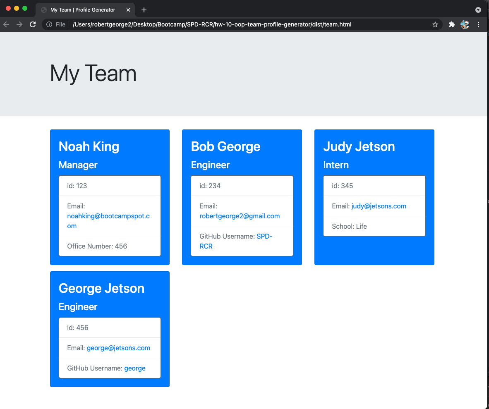

# hw-10-oop-team-profile-generator

10 Object-Oriented Programming: Team Profile Generator -- Your task is to build a Node.js command-line application that takes in information about employees on a software engineering team, then generates an HTML webpage that displays summaries for each person. Testing is key to making code maintainable, so you’ll also write a unit test for every part of your code and ensure that it passes each test.

Because this application won’t be deployed, you’ll need to provide a link to a walkthrough video that demonstrates its functionality and all of the tests passing. You’ll need to submit a link to the video AND add it to the readme of your project.

## Sample HTML file

https://github.com/SPD-RCR/hw-10-oop-team-profile-generator/blob/main/src/team.html

## Video Demo Walk-through

https://drive.google.com/file/d/1V47mGtSGIT1RqKysBMUsA9lGV57tM0FX/view

- Video Demo URL was also submitted with Coursework

1. The video starts by demonstrating running the test of the 4 x.test.js files

- Employee.test.js
- Engineer.test.js
- Intern.test.js
- Manager.test.js

2. Followed by initiating the Team Profile Generator from the command line via: node index.js

3. As the Manager, the Manager Must first answer the Manager questions before other employees can be added to the Team.

- Select 'Y', to add an Employee.
- Next, select the 'Engineer' role from the two choices.
- Answer the Engineer questions.

- Select 'Y', to add an employee.
- Next, select 'Intern' role from the two choices.
- Answer the Intern questions.

- Select N, to Not add a employee.
- The user is notified "Successfully wrote to team.html".

4. The team.html web page is then selected to be displayed in the default web browser.

- The web page is demonstrated to be responsive. Adjusting the content to display on various screen sizes.

## Screen shots

Test results in Terminal

team.html displayed on various screen sizes

- 
- 
- 
- 
- 
